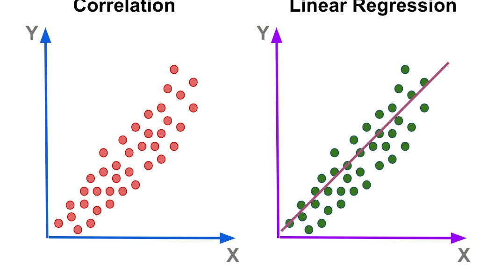
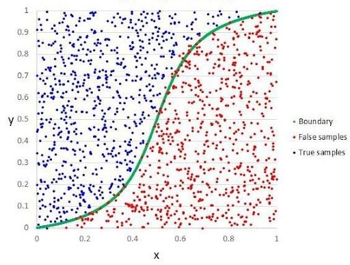
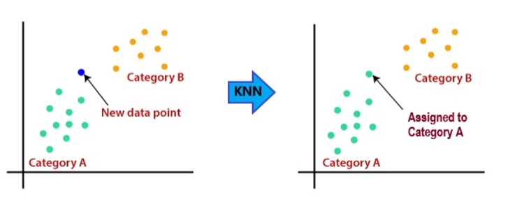
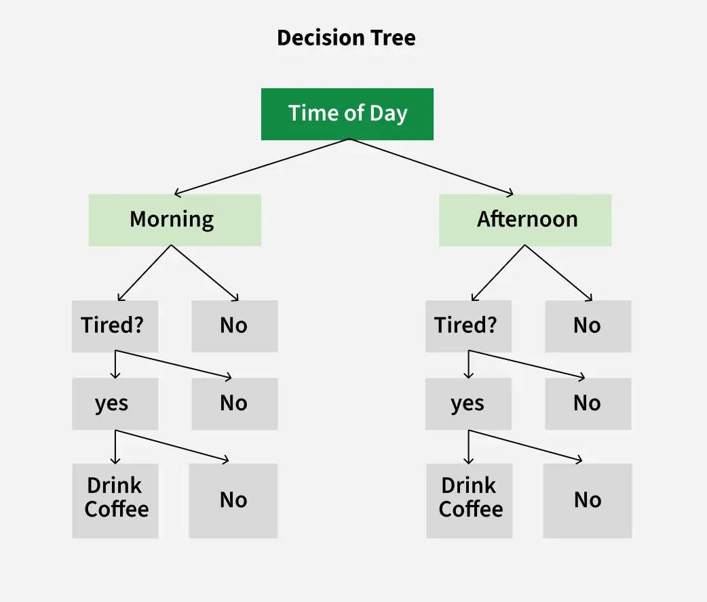
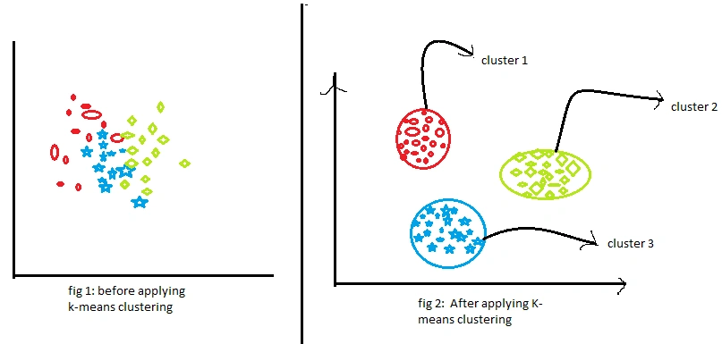
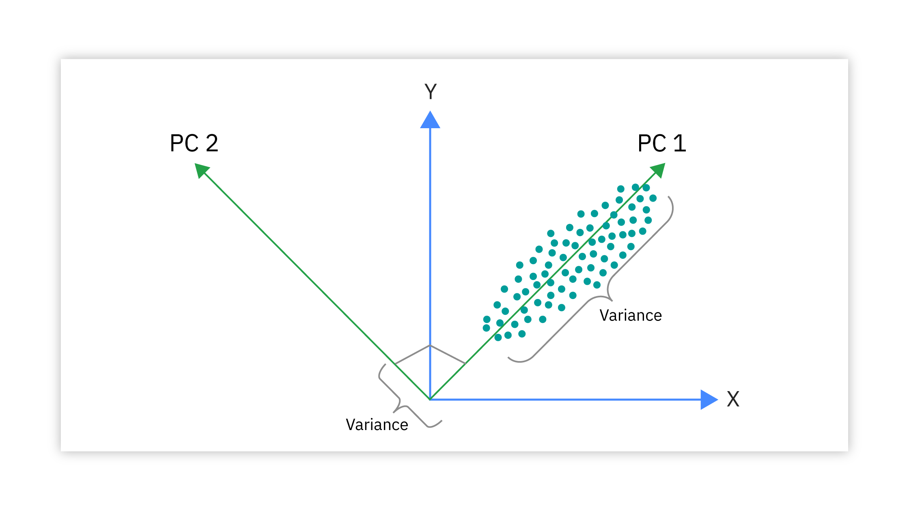

# Understanding Machine Learning: Building Core Algorithms with NumPy

***

### **1. What is Machine Learning (Artificial Intelligence)?**

At its heart, Machine Learning is a fascinating way of teaching computers to learn from experience, much like we do. Instead of providing a rigid set of instructions for every possible situation, we provide data and let the computer discover the patterns for itself. It’s a patient process of showing, not just telling.

* **Learning with an "Answer Key" (Supervised Learning):** This is the most common form of machine learning. Imagine a massive digital photo album where every image already has a perfect caption. You show this album—containing thousands of photos labeled "dog" and thousands labeled "cat"—to the computer. By studying these labeled examples, it learns the subtle visual patterns that distinguish a cat from a dog, eventually becoming skilled enough to label new, unseen photos with remarkable accuracy.

* **Finding Patterns on its Own (Unsupervised Learning):** Here, we give the computer a trove of unlabeled data and challenge it to find hidden structures. It's like being a digital detective, sifting through mountains of raw information for unexpected connections. For instance, you could give it data from a retail business, and it might uncover distinct customer archetypes—like the "Night Owl Shoppers" who buy after midnight or the "One-Click Spenders" who favor impulse buys—all without any prior hints.

* **Learning from Trial and Error (Reinforcement Learning):** This is how an AI learns to master a skill. Imagine an AI learning to ride a bike. It wobbles, overcorrects, and falls (a penalty), but with each attempt, it makes tiny adjustments to its balance and steering. These adjustments are guided by a single goal: stay upright and move forward (a reward). After millions of virtual attempts—of falling and adjusting—it develops an intuition for the task and can finally cycle smoothly. This is how AI learns to play complex games or control robotic arms.

* **The AI's Digital Workshop (NumPy):** To a computer, all data—whether a photo, a paragraph of text, or a sales report—is simply a structured list of numbers. NumPy (Numerical Python) is the foundational workshop for any AI builder. It provides the high-performance, precision tools—the digital hammers, saws, and measuring tapes—needed to construct and manipulate these vast arrays of numbers with incredible speed and efficiency.

### **2. The Two Core Ideas of Learning**

Regardless of the task, the learning process almost always revolves around these two fundamental concepts:

1.  **The "Mistake Score" (Cost Function):** After the computer makes a prediction, we need a way to measure how wrong it was. The Cost Function provides this "mistake score." Think of it as a measure of the model's "disappointment." A high score signals a huge, disappointing gap between its guess and reality. A low score means its guess was very close to the truth. The entire goal of training is to minimize this disappointment and get the score as low as humanly (and mathematically) possible.

2.  **Getting Better by Taking Smart Steps (Gradient Descent):** This is the elegant process the computer uses to lower its mistake score. The foggy mountain analogy is perfect: imagine being lost on a mountain in a thick fog, trying to get to the lowest valley. You can't see the destination, but you can feel the slope of the ground right beneath your feet. So, you take a small step in the steepest downward direction. You repeat this—feel the slope, take a step—and with each move, you get closer to your goal. Gradient Descent is the computer doing this mathematically, navigating from a state of high error to a state of minimum error with a series of small, intelligent steps.

### **3. Predicting a Continuous Number (Linear Regression)**

This technique is your go-to when you want the AI to predict a specific, continuous number, like a price, a height, or a temperature.

* **The Big Idea: The "Line of Best Fit"**
    Imagine you scatter a handful of coffee beans onto a large piece of paper, representing your data points (e.g., house size vs. house price). Linear Regression is the art of finding the one perfect position to lay down a ruler so that it slices right through the heart of the bean-cloud, best representing the general trend. This line, defined by its starting point and its angle, becomes your predictive model.

* **How it Learns:** The computer acts like a patient artist. It starts by drawing a random, poorly placed line. It checks its "mistake score"—how far, on average, the line is from all the real data points. Then, it begins a meticulous process of erasing and redrawing, making tiny adjustments to the line's angle and position. After each adjustment, it asks, "Did that lower the score?" This patient dance of trial and error, guided by the mathematics of Gradient Descent, continues until it discovers the one single line that produces the lowest possible score.

* **How We Grade It:**
    * **The Mistake Score, formally Mean Squared Error (MSE):** This gives you a concrete number representing the average squared difference between the model's predictions and the actual values. A smaller MSE is always better.
    * **The Report Card (R-squared):** This is often more insightful. It gives your model a grade, like 85%, that tells you how much of the puzzle your model has actually solved. An R-squared of 85% means that 85% of the variation in house prices can be explained by their size alone, which signals a very strong and useful model.

### **4. Predicting a Category (Logistic Regression)**

This is the tool for "either/or" predictions, where the answer is a distinct category: "Spam" or "Not Spam," "Approved" or "Denied."

* **The Big Idea: From a Score to a Confident Decision**
    This method brilliantly transforms an unbounded score into a clear, confident probability. It first calculates an evidence score based on the input data. Then, it uses a special function to elegantly squash that score, no matter how high or low, into a value neatly packaged between 0% and 100%.
    * **Example:** To decide if a loan application should be approved, the model considers income, credit history, and debt, calculating an overall "creditworthiness score." Logistic Regression then acts as the final judge, converting that score into something like a "95% probability of successful repayment," which allows for a confident, data-driven decision.

### **5. The "Birds of a Feather" Model (K-Nearest Neighbors, or KNN)**

* **The Big Idea: You're Judged by the Company You Keep**
    The K-Nearest Neighbors (KNN) algorithm is a beautifully simple and democratic approach to prediction. It operates on the principle that similar things exist in close proximity. It doesn't learn a grand "model" in the traditional sense; instead, it memorizes all the past examples and uses them for direct comparison.
    * **Example:** To recommend a new movie, the KNN model would identify the 'K' (let's say, 5) movies in its database that you've rated most similarly to the new one. If 4 of those 5 "neighboring" movies are action films that you loved, it will confidently recommend the new movie, assuming it's also an action film you'll enjoy. It’s a prediction based on a majority vote among the closest known examples.

### **6. The "20 Questions" Model (Decision Tree)**

* **The Big Idea: A Flowchart of Simple Questions**
    A Decision Tree builds a model that looks exactly like a branching flowchart or an upside-down tree. It makes its final decision by navigating a path of simple, sequential "yes/no" questions based on the data's features.
* **How it Learns:** The genius of a Decision Tree is how it learns which questions to ask and in what order. It doesn't ask random questions. Through the training process, it seeks out the most powerful, "data-splitting" questions to ask first—the ones that, in a single stroke, do the best job of separating the data into distinct, predictable groups.

### **7. Finding Hidden Groups (K-Means Clustering)**

* **The Big Idea: Discovering Natural Groups in Unlabeled Data**
    This is a cornerstone of Unsupervised Learning. It's used when you have a dataset without any pre-existing labels and you want to discover if it contains any natural clusters or segments.
    * **Analogy: The Event Host.** Imagine you're hosting an event where guests don't know each other. To break the ice, you place 5 large "topic signs" (e.g., "Technology," "Travel," "Food") around the room. Guests naturally gravitate toward the sign that most interests them. After a minute, you look at the groups that have formed and move each sign to the absolute center of its respective group. Guests may re-evaluate and move to a new sign that is now closer. This iterative process of grouping and re-centering continues until the clusters are stable, and you've successfully created social groups from a once-random crowd. K-Means performs this exact process with data points.

### **8. Summarizing Your Data (Principal Component Analysis, or PCA)**

* **The Big Idea: Reducing Complexity by Finding the Core Story**
    Often, data has hundreds of features, making it overwhelmingly complex. Principal Component Analysis (PCA) is a brilliant technique for reducing this complexity. It's a data compression method, but instead of making a file smaller, it makes the *story* of the data simpler and easier to understand.
    * **Analogy: The Master Chef.** A complex sauce might have 30 different ingredients (your features). A master chef tasting it wouldn't list all 30. Instead, they would identify the two fundamental flavor axes that truly define the experience: for instance, the "richness-to-lightness" axis and the "sweet-to-savory" axis. PCA acts like this sophisticated chef for your data. It analyzes all the features and extracts the most important underlying concepts—the "Principal Components"—that capture the most significant information, allowing you to tell a compelling story with just a few key ideas instead of a hundred confusing details.